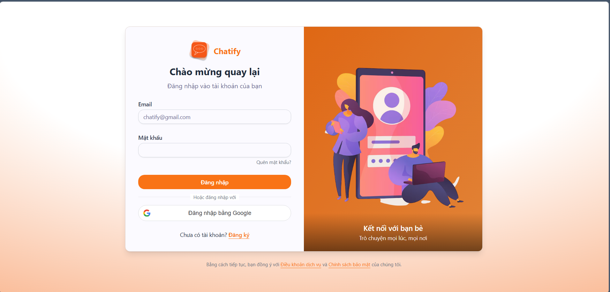
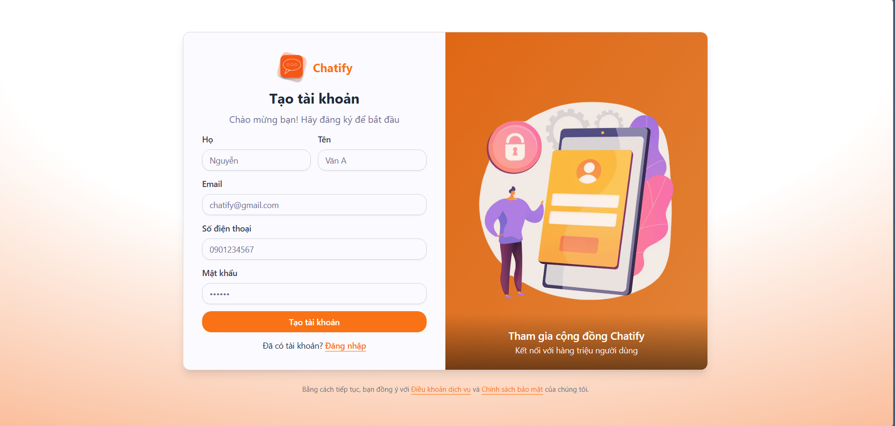
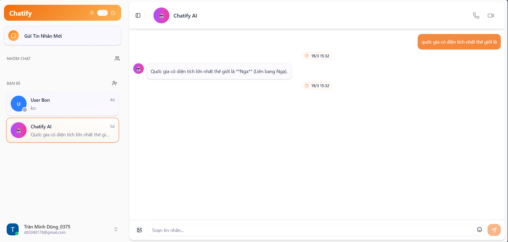
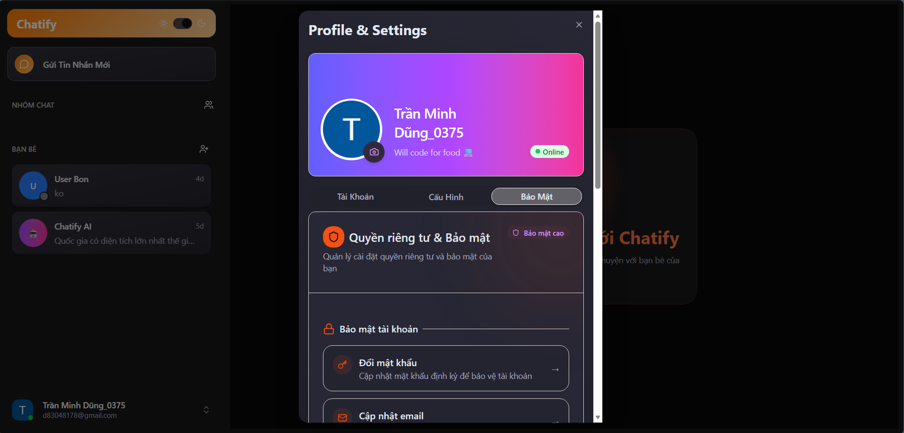
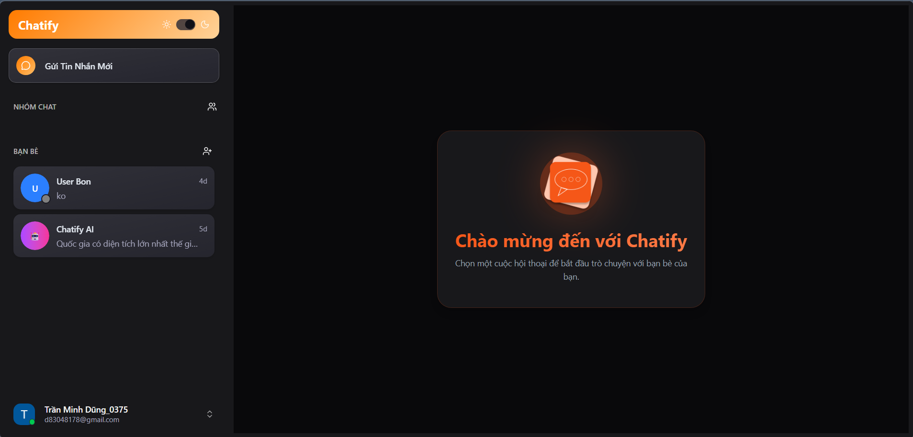
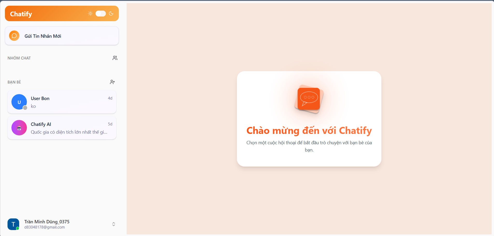

# 💬 MERN Realtime Chat Application

A full-stack realtime chat application built with the **MERN Stack** featuring secure authentication and realtime messaging powered by **Socket.IO**.

This project demonstrates the design and implementation of a scalable realtime communication system combining REST APIs and WebSocket architecture.

---

## 🚀 Features

* 🔐 Secure authentication with JWT + HTTP-only cookies
* 🔑 Social login via Google OAuth 2.0
* ✉️ Email registration with OTP verification
* 💬 Realtime messaging powered by Socket.IO
* 👥 Direct user conversations
* 🟢 Online/offline presence tracking
* 📨 Persistent chat history with MongoDB
* 🤖 AI chatbot integration using Google Gemini API
* 🔍 Smart conversation handling (User ↔ AI chat separation)
* 🛡 Protected routes on both frontend & backend
* ⚡ Modern, responsive UI

---

## ⭐ Technical Highlights

* Designed hybrid REST + WebSocket architecture for realtime communication
* Implemented bidirectional messaging using Socket.IO rooms
* Built secure authentication system (JWT + HTTP-only cookies + Google OAuth 2.0)
* Integrated AI chatbot using Google Gemini API
* Implemented OTP-based email verification using Nodemailer
* Developed media upload system with Multer & Cloudinary
* Designed modular backend architecture with clear separation of concerns
* Documented APIs using Swagger UI
* Centralized frontend state using Zustand
* Optimized UX with infinite scrolling, animations, and emoji support
* Persistent messaging system using MongoDB & Mongoose

---

## 🛠 Tech Stack

### Frontend

* React (Vite + TypeScript)
* TailwindCSS + shadcn/ui
* Zustand (State Management)
* Axios (API communication)
* Socket.IO Client (Realtime)
* React Hook Form + Zod (Form validation)
* Framer Motion (Animations)

### Backend

* Node.js + Express.js
* MongoDB + Mongoose
* Socket.IO (Realtime communication)
* JWT Authentication (HTTP-only cookies)
* Google OAuth 2.0
* Google Gemini API (AI chatbot)
* Nodemailer (Email & OTP verification)
* Multer + Cloudinary (File upload & storage)
* Swagger UI (API documentation)

---

## 📂 Project Structure

```
mern-realtime-chat/
│
├── backend/
│   └── src/
│       ├── controllers/
│       ├── libs/
│       ├── middlewares/
│       ├── models/
│       ├── routes/
│       ├── socket/
│       ├── utils/
│       ├── server.js
│       └── swagger.json
│
├── frontend/
│   └── src/
│       ├── assets/
│       ├── components/
│       ├── features/
│       ├── hooks/
│       ├── lib/
│       ├── pages/
│       ├── services/
│       ├── stores/
│       └── types/
│
├── screenshots/
│   ├── signin.png
│   ├── signup.png
│   ├── chat.png
│   ├── profile.png
│   ├── dark.png
│   └── light.png
│
└── README.md
```

---

## ⚙️ Installation & Setup

### 1️⃣ Clone Repository

```bash
git clone https://github.com/tranminhdung12121/mern-realtime-chat.git
cd mern-realtime-chat
```

---

### 2️⃣ Backend Setup

```bash
cd backend
npm install
```

Create a `.env` file:

```env
PORT=5000
MONGODB_URI=your_mongodb_uri

CLIENT_URL=http://localhost:5173

ACCESS_TOKEN_SECRET=your_access_token_secret
JWT_SECRET=your_jwt_secret

CLOUDINARY_CLOUD_NAME=your_cloud_name
CLOUDINARY_API_KEY=your_api_key
CLOUDINARY_API_SECRET=your_api_secret

EMAIL_USER=your_email
EMAIL_PASS=your_email_password

GOOGLE_CLIENT_ID=your_google_client_id

GG_AI_API_KEY=your_gemini_api_key
```

Run backend:

```bash
npm run dev
```

---

### 3️⃣ Frontend Setup

```bash
cd ../frontend
npm install
npm run dev
```

---

## 🔄 System Architecture

### REST API Flow

Client → Express API → MongoDB

* Handles authentication, user management, and data persistence
* Uses stateless JWT-based authentication

---

### Realtime Communication Flow

Client ⇄ Socket.IO Server ⇄ Connected Clients

* Uses WebSocket protocol for bidirectional communication
* Implements Socket.IO rooms for private conversations
* Tracks online/offline presence in realtime

---

### Messaging Pipeline

* Messages are emitted via WebSocket events
* Persisted into MongoDB for durability
* Synced across clients instantly for realtime experience

---

## 🎯 Project Goals

* Build a scalable realtime messaging system from scratch
* Understand WebSocket lifecycle and event-driven architecture
* Design secure authentication flows (JWT, OAuth, OTP)
* Apply modular & maintainable backend architecture
* Integrate AI capabilities into a fullstack application
* Deliver smooth user experience with realtime updates

---

## 📸 Screenshots

### 🔐 Login



### 📝 Sign Up



### 💬 Realtime Chat



### 👤 Profile



### 🌙 Dark Mode



### ☀️ Light Mode



---

## 🌐 Live Demo

👉 https://mern-realtime-chat-frontend.vercel.app/

---

## 🔮 Future Improvements

* 🔔 Realtime message notifications
* ✍️ Typing indicators (Socket.IO events)
* 📎 File sharing (Cloudinary integration)
* ❤️ Message reactions & interactions
* 🐳 Deployment with Docker & CI/CD pipeline
* ⚡ Performance optimization & caching

---

## 👨‍💻 Author

**Tran Minh Dung**
Fullstack Web Developer

* GitHub: https://github.com/tranminhdung12121
* Email: [tranminhdung044@gmail.com](mailto:tranminhdung044@gmail.com)
